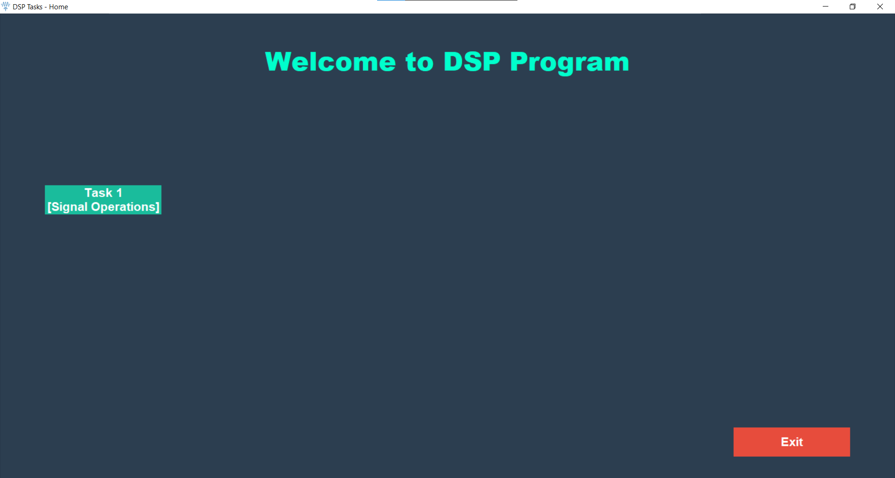
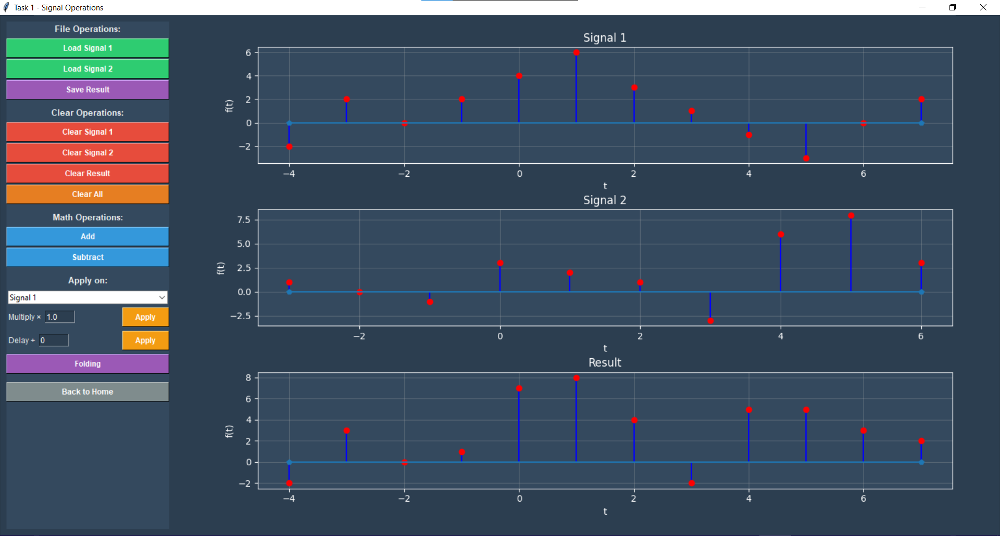
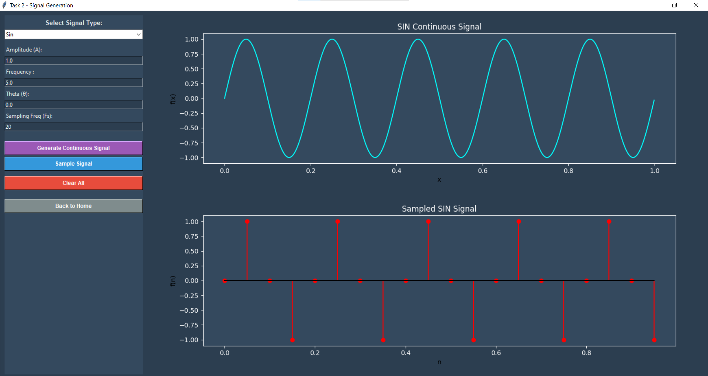
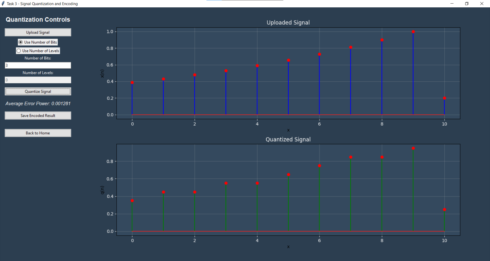

# 📡 Digital Signal Processing Tasks

*🎯 Digital Signal Processing application with GUI interface for signal operations*

---

This project implements various **digital signal processing tasks** using Python with a graphical user interface. The application provides tools for reading, visualizing, and manipulating discrete signals through mathematical operations.

## 🚀 Task 1

### ⚡ Functionality

Task 1 implements basic signal operations including:

| Operation | Description |
|-----------|-------------|
| 📖 **Signal Reading** | Load discrete signals from text files with index-value format |
| 📊 **Signal Visualization** | Display signals using matplotlib stem plots |
| ➕ **Signal Addition** | Combine two signals element-wise |
| ➖ **Signal Subtraction** | Subtract one signal from another |
| ✖️ **Signal Multiplication** | Amplify or reduce signal amplitude by a constant factor |
| ⏰ **Signal Delay/Advance** | Shift signal in time domain by k steps [x(n+k) or x(n-k)] |
| 🔄 **Signal Folding** | Reverse signal in time domain [x(-n)] |
| 💾 **File Operations** | Save processed signals and clear data |

*🎮 Task 1 interface showing signal plots and operation controls*

---

## 🚀 Task 2

Task 2 introduces **signal generation and visualization** for both continuous and discrete signals. Users can generate **sine** or **cosine** waves with adjustable amplitude, frequency, phase shift, and sampling rate, and compare two signals simultaneously.

*🌊 Task 2 interface showing continuous and discrete wave generation*

---

## 🚀 Task 3

Task 3 implements **signal quantization and encoding**. Users can load a discrete signal, quantize it using a specified number of bits or levels, visualize the original and quantized signals, view the average quantization error power, and save the encoded results (binary codes and quantized values).

*📊 Task 3 interface showing signal quantization and encoding*

---

